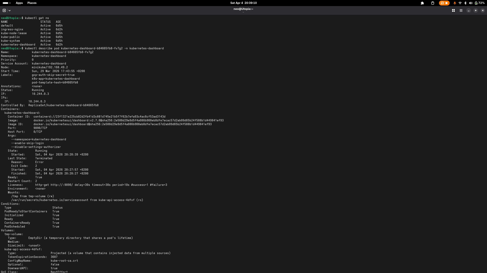
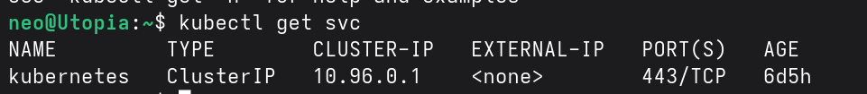
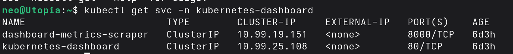
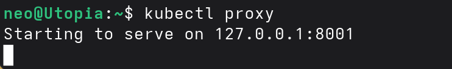
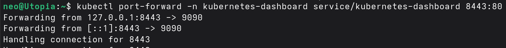
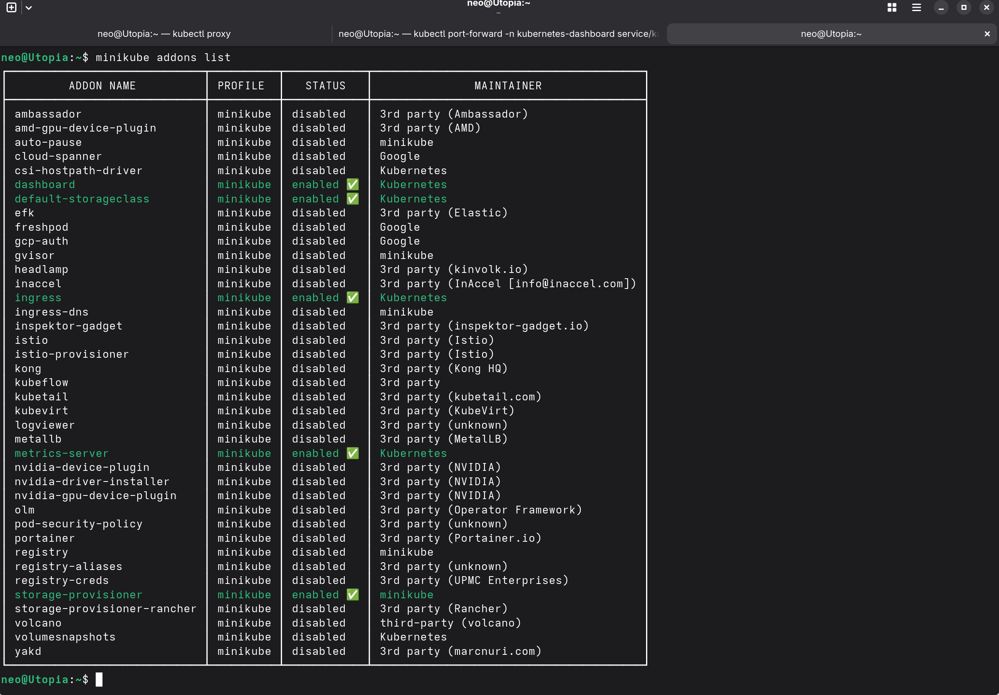
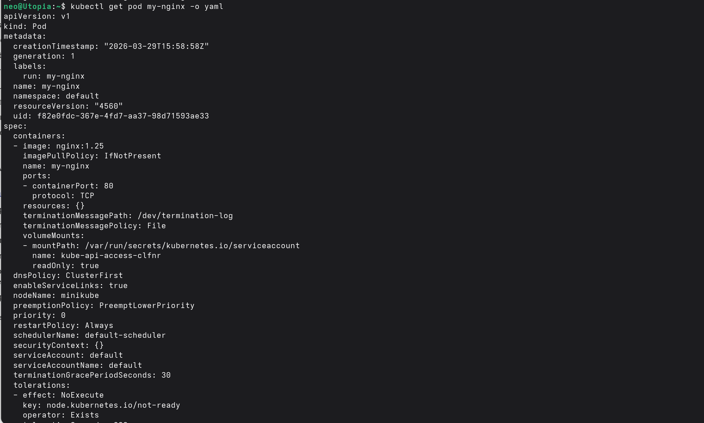
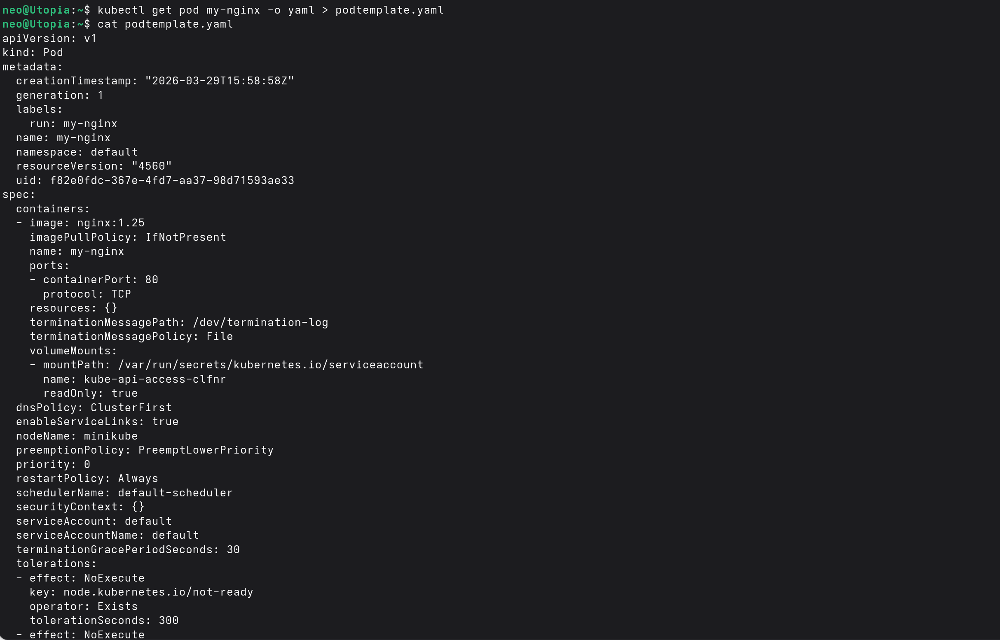
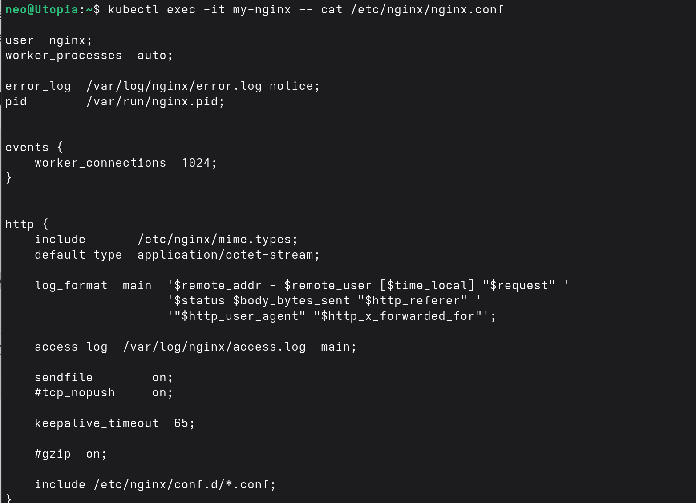
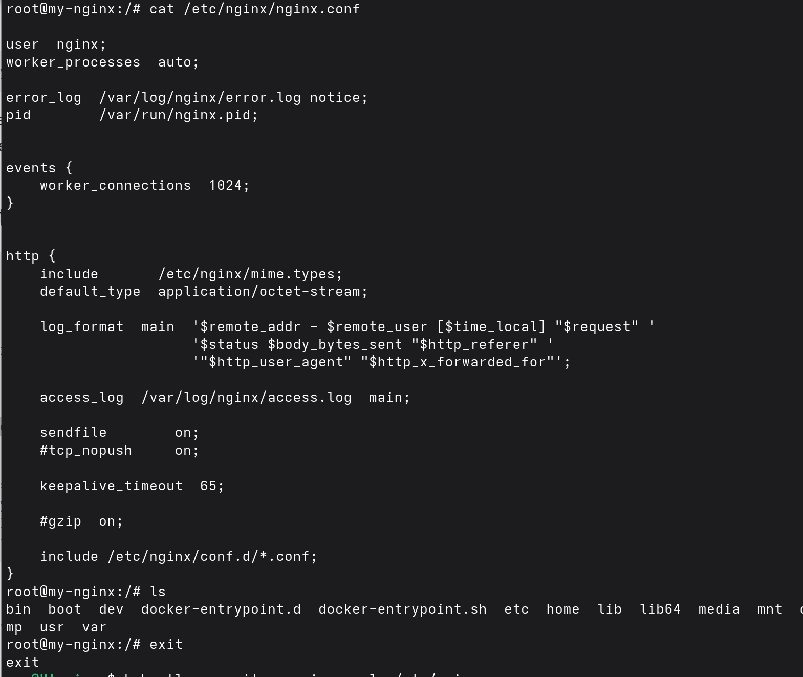

# Week 2 - April 4, 2026

Session notes from our second weekly meet. We continued exploring beyond Lab 1, diving into services, the Kubernetes dashboard, pod introspection, and exec-ing into containers.

---

## Inspecting the Dashboard Pod

Using `kubectl describe` on the `kubernetes-dashboard` pod to see its full spec - image, ports, volumes, mounts, events, and conditions.

---

## Listing Services - Default Namespace

`kubectl get svc` in the default namespace. Only the `kubernetes` ClusterIP service exists here (the API server endpoint).

---

## Listing Services - Dashboard Namespace

`kubectl get svc -n kubernetes-dashboard` shows two services: the `dashboard-metrics-scraper` on port 8000 and the `kubernetes-dashboard` on port 80, both ClusterIP.

---

## Starting kubectl proxy

`kubectl proxy` starts a local proxy to the Kubernetes API server on `127.0.0.1:8001`. This is one way to access the dashboard without exposing it externally.

---

## Port-forwarding the Dashboard

`kubectl port-forward -n kubernetes-dashboard service/kubernetes-dashboard 8443:80` - forwarding local port 8443 to the dashboard service. This gives direct browser access to the dashboard UI.

---

## Minikube Addons

`minikube addons list` showing all available addons and their status. Enabled addons: `dashboard`, `default-storageclass`, `ingress`, `metrics-server`, `storage-provisioner`.

---

## Pod YAML Output

`kubectl get pod my-nginx -o yaml` dumps the full YAML spec of the running pod - image, ports, volume mounts, restart policy, tolerations, and all Kubernetes-managed fields.

---

## Saving Pod YAML to File

Redirecting the YAML output to `podtemplate.yaml` with `kubectl get pod my-nginx -o yaml > podtemplate.yaml`, then inspecting it with `cat`. Useful for creating templates from running pods.

---

## Exec into Pod - Reading nginx.conf

`kubectl exec -it my-nginx -- cat /etc/nginx/nginx.conf` - reading the nginx configuration file directly from inside the running container without entering a shell.

---

## Exec into Pod - Interactive Shell

Getting a full shell inside the container with `kubectl exec -it my-nginx -- bash`, then browsing the filesystem with `ls` and exiting. This is how you debug containers in real scenarios.

