# Week 3 - April 11, 2026

Session notes from our third weekly meet. We wrapped up the Kubernetes 101 flow with Deployments, scaling, rolling updates, rollbacks, update strategy tuning, and a quick resource check.

---

## Warm-up: API Versions

We started by listing the API groups available in the cluster with `kubectl api-versions`.

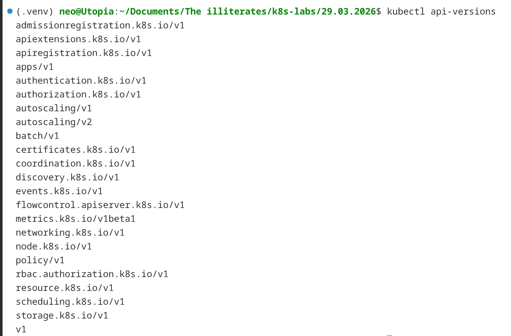

---

## Defining the Deployment

We built the `deployment.yaml` manifest for `web-app` with 3 replicas, `nginx:1.24`, and basic CPU and memory requests.

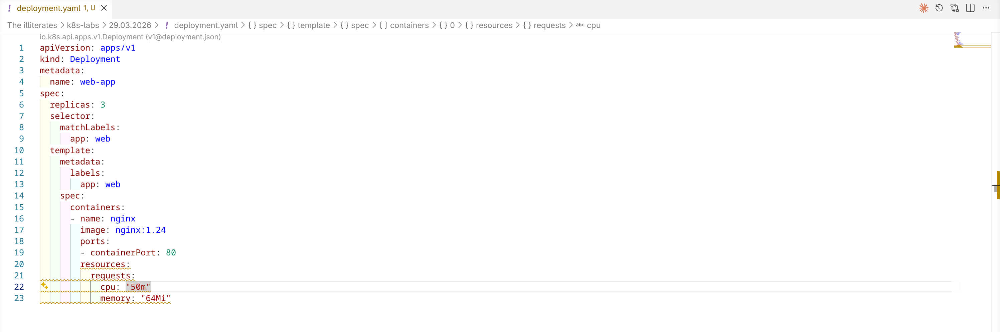

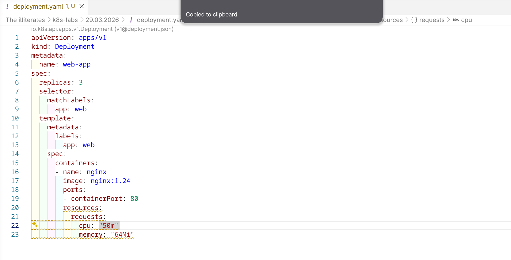

---

## First Apply and Self-Healing

After applying the manifest, we cut one pod to prove the Deployment controller brought it back at once.

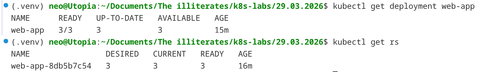

---

## Scaling Up and Down

We scaled the Deployment up to 5 replicas and then back down to 2 to see how quickly the pod count changed.

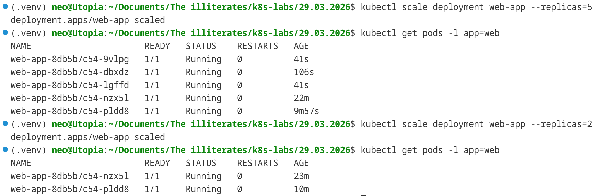

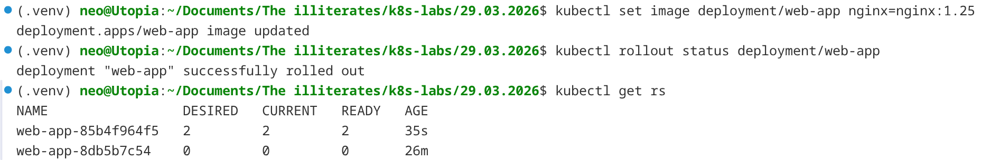

---

## Rolling Updates

We updated the image with `kubectl set image` and watched the rollout complete. Later, we re-applied the manifest after editing it and confirmed the image change took effect.

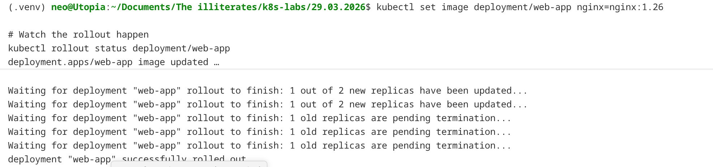

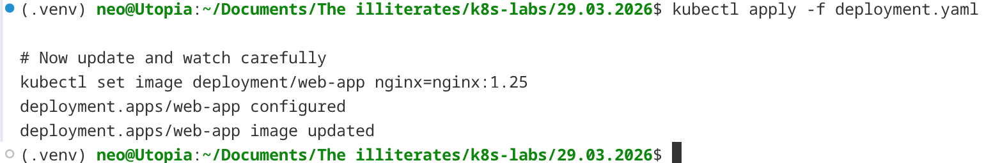

---

## Rollback and Restart

We checked rollout history, rolled back to an earlier revision, and used a rollout restart to force fresh pods.

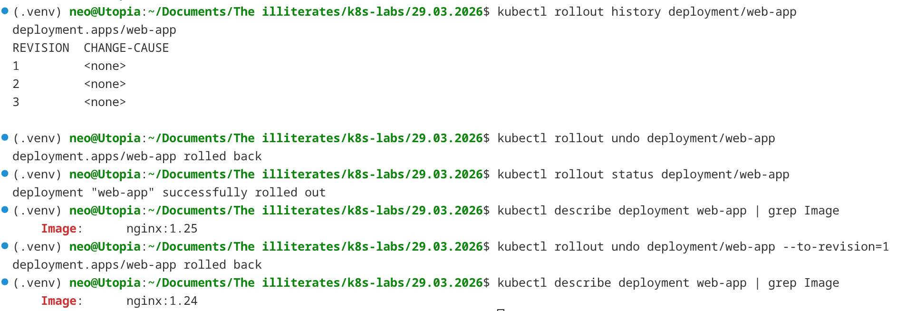

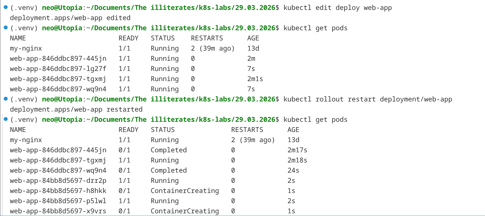

---

## Update Strategy Tuning

We changed the rolling update strategy to control availability during updates.

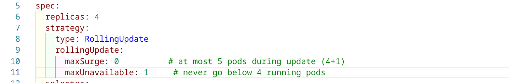

---

## Resource Check

We finished with `kubectl top pods -l app=web` to check live CPU and memory usage.

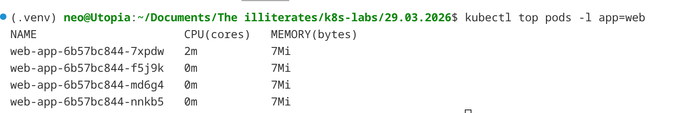

---

## Key Takeaways

1. Deployments own ReplicaSets and replace missing pods automatically.
2. You can scale declaratively with `replicas` or imperatively with `kubectl scale`.
3. `kubectl set image`, `rollout history`, and `rollout undo` make updates and rollbacks fast.
4. We used `strategy.maxSurge` and `strategy.maxUnavailable` to control availability during updates.
5. `kubectl top` is the quickest way to sanity-check live resource usage.
