# Docker Slides

Interactive Reveal.js slides are available, but some hosting (for example, ReadTheDocs) may block inline scripts or external CDNs which can break the interactive view.

If the interactive deck does not work in your environment, use the static gallery below or open the standalone deck (opens in a new tab): [Open interactive deck](./deck.html){:target="_blank"}

---

## Static gallery

Below are the slides rendered as static images. This view is compatible with ReadTheDocs and safe for static hosting.

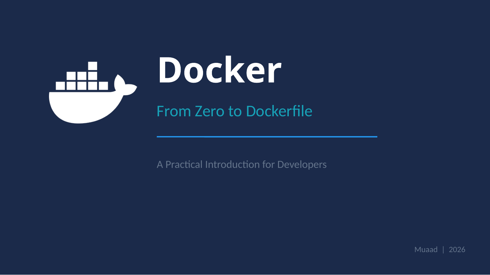

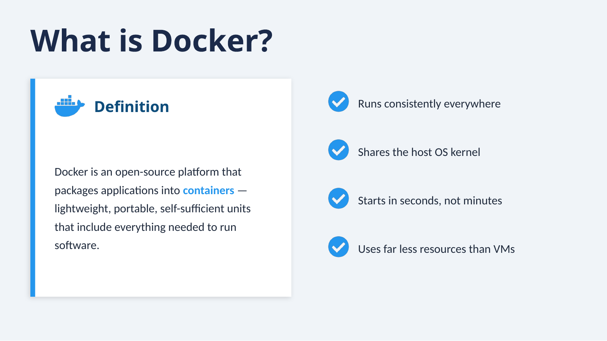

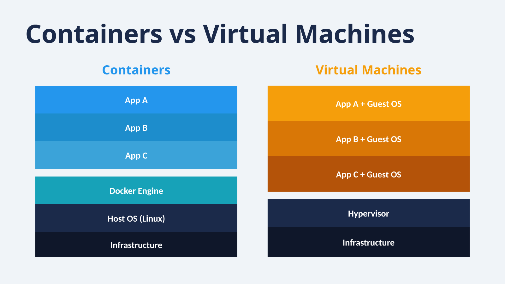

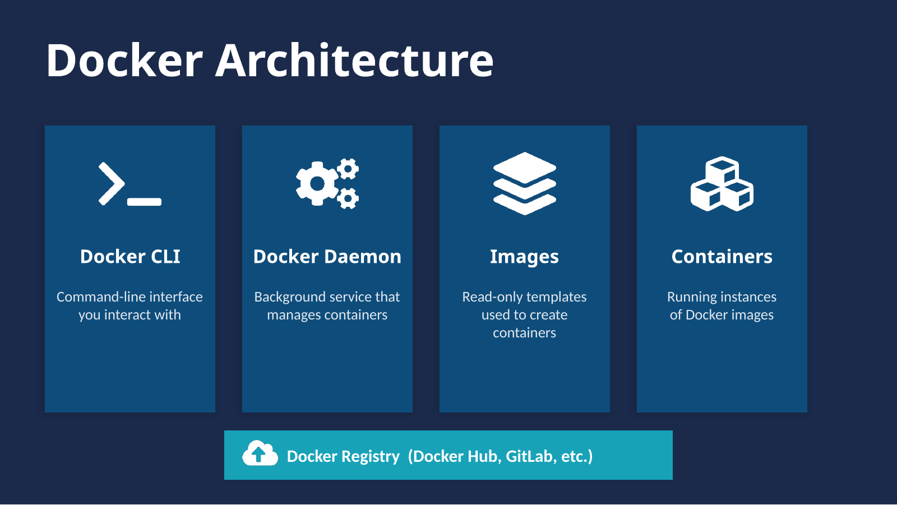

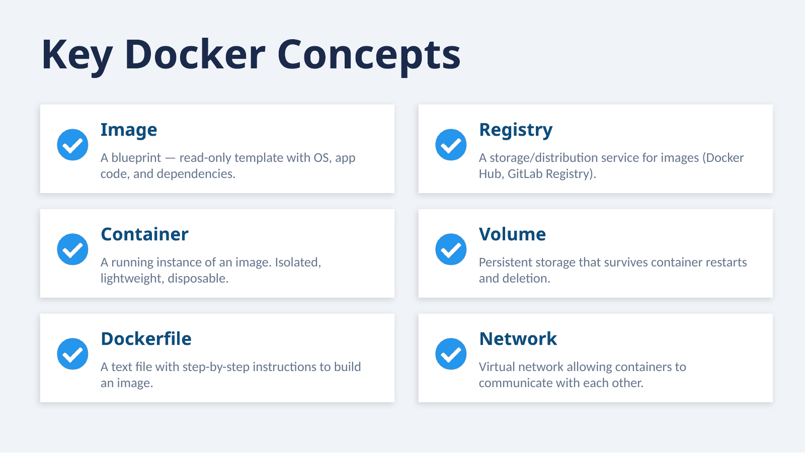

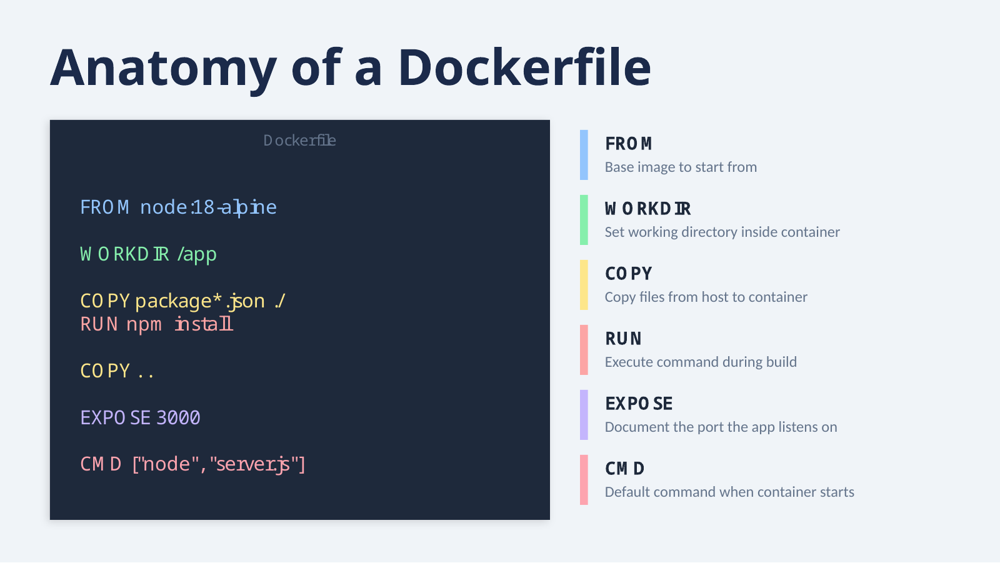

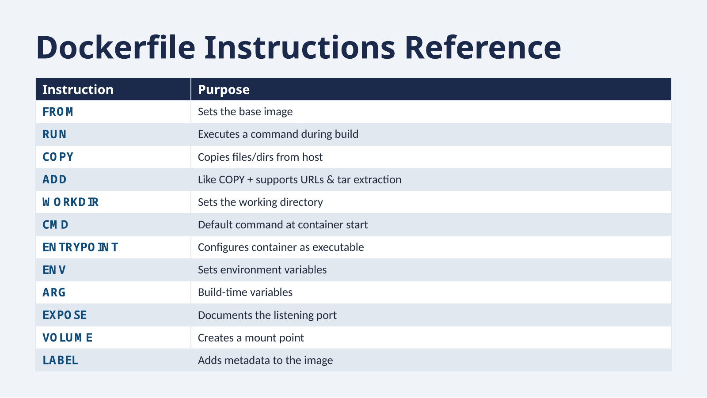

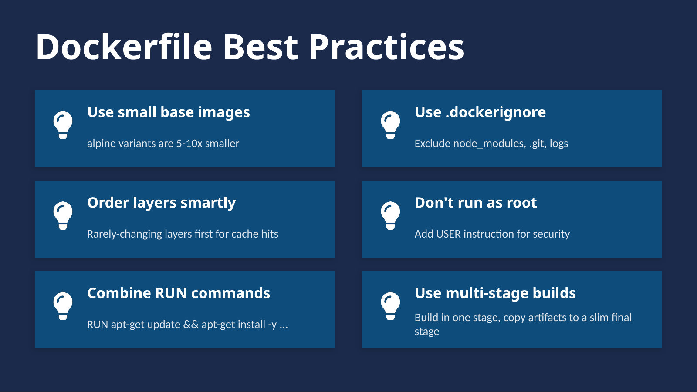

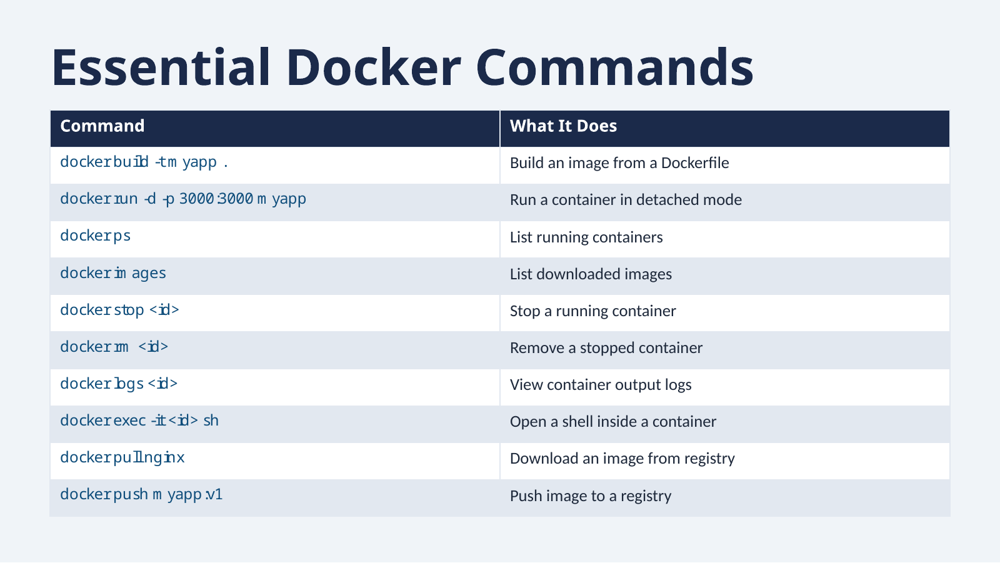

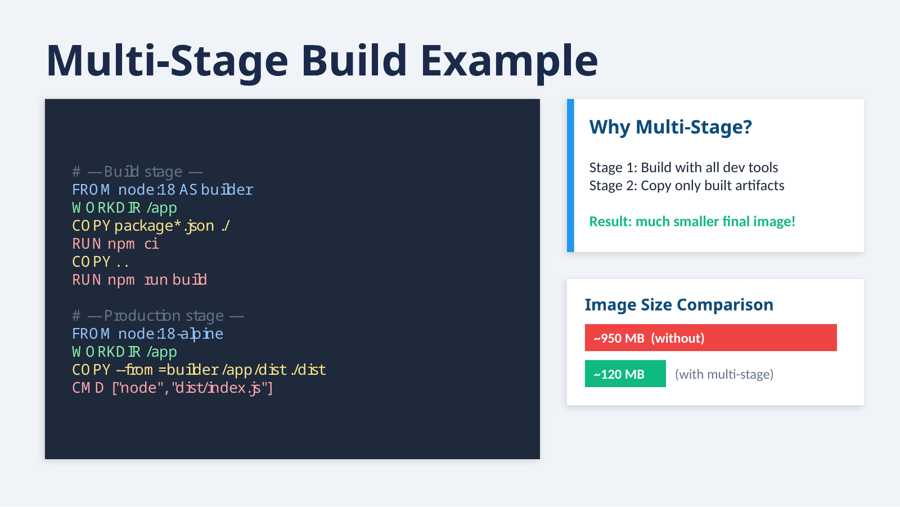

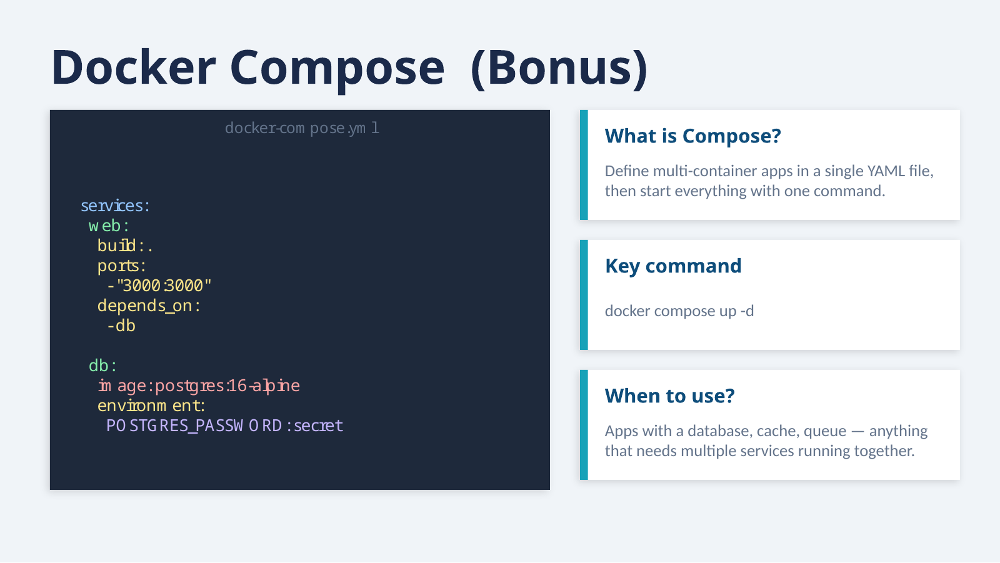

